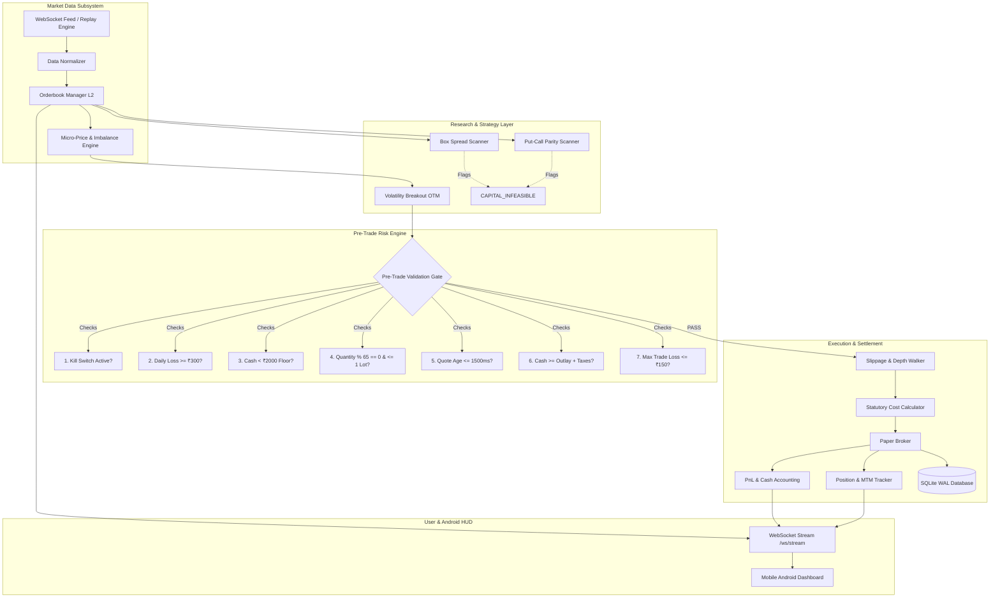

# System Architecture & Technical Specification

## 1. High-Level Architecture

The NIFTY Options Arbitrage & Trading System is designed as a decoupled, asynchronous, event-driven pipeline where market data ingestion, risk management, execution, and user telemetry are strictly segregated.



---

## 2. Invariants & Fail-Closed Guards

### 2.1 Live Execution Invariant
```python
# execution/live_broker_disabled.py
class LiveTradingPermanentlyDisabledBroker(AbstractBrokerClient):
    def __init__(self):
        raise RuntimeError("Live trading is permanently disabled in V1 by specification.")
```
Under no environmental condition can live orders be dispatched to an exchange or broker API.

### 2.2 NSE Lot Size Invariant (65 Units)
Conforming to NSE circular `NSE/FAOP/70616` (effective January 2026), the NIFTY lot size is hardcoded as `65`. Any order quantity $Q$ where $Q \pmod{65} \neq 0$ or $Q > 65$ is rejected with code `REJECT_LOT_SIZE`.

### 2.3 Stale Data Guard (1,500ms)
Options market microstructure in volatile markets can produce catastrophic executions if orders are placed on delayed quotes. The `StaleDataGuard` verifies that:
$$t_{\text{current}} - t_{\text{tick}} \le 1500\text{ ms}$$
If this threshold is exceeded, the execution gate rejects the order with `STALE_DATA_HALT`.

### 2.4 Emergency Kill Switch
The latching kill switch transitions from `NORMAL` to `ENGAGED` upon:
- Manual operator engagement via Web HUD or REST API.
- Daily realized loss exceeding ₹300.00.
- Account cash dropping below emergency floor ₹2,000.00.
Once engaged, it can only be reset with the explicit verification token `"CONFIRM_RESET"`.

---

## 3. Indian Derivatives Cost Schedule (2026)

| Fee Component | Rate / Formula | Applied On | Example (1 Lot @ ₹30 Buy / ₹35 Sell) |
|---|---|---|---|
| **Brokerage** | ₹20.00 flat per order leg | Per execution | ₹40.00 round trip |
| **STT** | 0.10% on premium turnover | Sell side only | ₹2.27 |
| **Exchange Txn Fee** | 0.05% on premium turnover | Buy & Sell | ₹2.11 |
| **GST** | 18% on (Brokerage + Txn + SEBI) | Buy & Sell | ₹7.58 |
| **Stamp Duty** | 0.003% on premium turnover | Buy side only | ₹0.06 |
| **SEBI Turnover Fee** | 0.0001% (₹10 / crore) | Buy & Sell | ₹0.00 |
| **Total Friction** | | | **₹52.02** |
| **Points Hurdle** | Total Friction / 65 | Index points | **0.80 points** |

---

## 4. Capital Feasibility Analysis (₹3,000 Hypothesis)

### 4.1 Synthetic Futures & Put-Call Parity
Put-Call Parity asserts:
$$C - P = S - K \cdot e^{-rT}$$
Arbitrage requires shorting the overpriced synthetic and longing the underpriced synthetic.
- **Short Option Leg:** Requires ₹1,35,000 to ₹1,45,000 SPAN margin.
- **Short Future Leg:** Requires ₹1,25,000 SPAN margin.
- **Account Capital:** ₹3,000.
- **Margin Shortfall:** > ₹1,30,000 (43x deficit).
- **Classification:** `CAPITAL_INFEASIBLE`.

### 4.2 Box Spreads
Box Spreads require four simultaneous legs across two strikes ($K_1 < K_2$).
- Even with portfolio hedge offset, NSE margin demands a minimum of ₹65,000 to ₹90,000.
- Transaction friction across 8 order legs equals ~₹290.00 (9.7% of total capital).
- **Classification:** `CAPITAL_INFEASIBLE`.

### 4.3 Permitted Feasible Strategy: Single-Leg OTM Volatility Breakout
- **Instrument:** Single-leg Call or Put ($P \le ₹38.00$).
- **Maximum Outlay:** $38 \times 65 = ₹2,470.00 \le ₹3,000.00$.
- **Stop Loss:** 1.6 points ($\Delta P \times 65 = ₹104.00$ gross loss + ₹45 round-trip fee = ₹149 total risk $\le ₹150$ cap).
- **Target:** 4.0 points ($4.0 \times 65 = ₹260$ gross gain - ₹45 fee = ₹215 net profit).
- **Classification:** `CAPITAL_FEASIBLE`.
