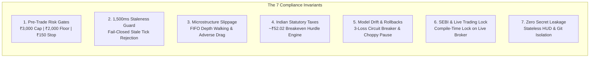

# INSTITUTIONAL AUDIT COMPLIANCE & VERIFICATION SPECIFICATION

**Document Version:** `1.0.0-COMPLIANCE`  
**System Target:** SerQ Institutional NIFTY Options Arbitrage & Real-Time Trading Engine  
**Repository Location:** `/root/nifty-options-arbitrage`  
**Git Branch:** `main` | **Commit Baseline:** `f740830`  
**Regulatory Framework:** 
* SEBI Circular `SEBI/HO/MRD/DP/CIR/P/2018/62` (Algorithmic Trading & Risk Testing)
* SEBI Circular `SEBI/HO/MIRSD/MIRSD-PoD/P/CIR/2025/0000013` (Retail Algorithmic Framework)
* NSE Circular `NSE/FAOP/70616` (NIFTY 50 Options Lot Size = 65)  
**Classification:** Analytical Research Station & Paper Trading Daemon (V1/V2) — **Live Execution Sealed**

---

## 1. Executive Overview & Auditor Mandate

This specification provides a standardized, reproducible compliance protocol for independent auditors, quant engineers, risk managers, and regulatory officers to inspect and verify the **SerQ NIFTY Options Arbitrage & Trading Engine**.

### 1.1 What This System Is
SerQ is an asynchronous, event-driven trading workstation engineered specifically for **single-lot micro-capital options trading** under an uncompromising **₹3,000 account capital constraint**. It combines:
1. **Deterministic Micro-Capital Risk Engine:** Mathematical pre-trade validation strictly preventing over-leveraged multi-leg SPAN exposure and enforcing a hard ₹2,000 capital floor.
2. **Microstructure Slippage & Fee Engine:** Models real-world Indian statutory taxes (~₹52.02/lot round-trip) and Level-2 orderbook queue walking.
3. **Adaptive Machine Learning Strategy:** Online Recursive Least Squares (RLS) and Bayesian Thompson Sampling with automated drift rollbacks.
4. **Multimodal Macro Fusion:** Ingests Brent crude, DXY, GIFT Nifty gap, and geopolitical news embeddings.
5. **Real-Time Mobile-First HUD:** Low-latency (<250ms) Starlette ASGI and WebSocket telemetry interface.

---

## 2. What to Audit: The 7 Core Invariants

An auditor must inspect seven critical dimensions to certify system compliance:



### Invariant 1: Pre-Trade Risk Controls (`risk/engine.py`, `risk/kill_switch.py`)
* **Capital Floor:** Cash balance must never breach ₹2,000.00. If cash $< ₹2,000$, all further orders must be immediately blocked.
* **Max Premium Cap:** Options premium must be $\le ₹38.00$ (max capital outlay $\le ₹2,470$ for 65 units), ensuring $> ₹530$ liquid cash headroom.
* **Per-Trade Stop Loss:** Hard-capped at ₹150.00 (~2.30 points).
* **Max Daily Loss:** Hard-capped at ₹300.00.
* **Lot Size Invariant:** All orders must specify exactly 65 units (1 lot). Any order with quantity $\ne 65$ or lots $> 1$ must be rejected.
* **Latching Kill Switch:** Engaging the kill switch must transition state in $< 1\,\mu\text{s}$ and latch permanently until an explicit `CONFIRM_RESET` cryptographic token is supplied by the operator.

### Invariant 2: Fail-Closed Staleness Guard (`risk/stale_data_guard.py`)
* Market ticks with latency $> 1,500\,\text{ms}$ or missing orderbooks (`age_ms = inf`) must be dropped immediately. Orders relying on stale ticks must be rejected.

### Invariant 3: Realistic Microstructure Slippage (`costs/slippage.py`, `execution/paper_broker.py`)
* Fills must never be granted unrealistically at Mid-Price or LTP.
* The paper broker must simulate:
  1. FIFO Queue Priority (60% depth ahead of retail orders).
  2. Level-2 orderbook depth walking (VWAP execution).
  3. Adverse selection penalty in fast-moving regimes.
  4. Book exhaustion penalty of 1.50 points on depleted depth.

### Invariant 4: Statutory Transaction Cost Schedule (`costs/transaction_costs.py`)
* The system must model exact Indian 2026 derivative regulatory taxes:
  - **Securities Transaction Tax (STT):** 0.1% on exercise value or 0.0625% on option premium turnover (sell side).
  - **Brokerage:** ₹20.00 flat per executed order.
  - **Exchange Turnover Charges:** 0.0505% on premium turnover.
  - **SEBI Turnover Charges:** ₹10 per crore (0.0001%).
  - **Goods and Services Tax (GST):** 18% on (Brokerage + Exchange Charges + SEBI charges).
  - **Stamp Duty:** 0.003% on buy side.
  - **Combined Round-Trip Hurdle:** $\approx ₹52.02$ per lot (~0.80 points minimum move required just to break even).

### Invariant 5: Model Drift Guard & Regime Discipline (`ml/drift_guard.py`, `ml/learner.py`)
* **Overfitting / Drift Guard:** If the strategy experiences 3 consecutive losses, parameter weights must automatically roll back to the previous stable checkpoint.
* **Choppy Market Stand-Down:** In `CHOPPY_CONSOLIDATION` regimes, the learner must stand down (0 trades) to avoid theta decay traps.

### Invariant 6: Permanent Live Trading Lock (`execution/live_broker_disabled.py`)
* Live execution pathways must raise compile-time and runtime `RuntimeError` exceptions (`LiveTradingPermanentlyDisabledError`) to prevent accidental live execution.

### Invariant 7: Zero Secret Leakage & Architecture Isolation (`broker/`, `dashboard/`)
* Zero credentials, broker API keys, or TOTP seeds committed to git or exposed to the browser HUD.

---

## 3. How to Audit: Step-by-Step Auditor's Playbook

All verification steps are self-contained and run via the institutional `./serq` CLI within `/root/nifty-options-arbitrage`.

```bash
cd /root/nifty-options-arbitrage
```

### Audit Step 1: Execute Full Test Suite
Verifies that all 113 unit and integration tests across 20 test modules pass:
```bash
./serq test
# Alternatively: python3 -m pytest tests/ -v
```
**Expected Audit Result:** `113 passed in ~21s (100% pass rate)`.

---

### Audit Step 2: Run Adversarial Stress & Risk Gate Audit
Simulates severe market shocks, false breakouts, and capital floor breaches:
```bash
./serq stress
```
**Expected Audit Result:**
- Phase 1: 3 consecutive false breakouts trigger `ModelDriftGuard` rollback.
- Phase 2: Cash simulated below ₹2,000 floor immediately engages latching Kill Switch.
- Phase 3: 100% of subsequent order attempts hard-blocked with `REJECTED`.
- Phase 4: Cryptographic token verification validates reset protocol.
- **Verdict:** `PASSED (100% INVARIANTS HELD)`.

---

### Audit Step 3: Inspect AI Model Drift & Rolling Health
Verifies rolling win rate, Sharpe ratio, and consecutive loss counters:
```bash
./serq drift
```
**Expected Audit Result:**
- `Drift Status: ● HEALTHY`
- `Guard Invariant: Zero statistical drift detected`

---

### Audit Step 4: Run Continuous Paper Soak Simulation
Executes multi-day walk-forward market simulations to audit regime switching and PnL persistence:
```bash
./serq soak 5 0.01
```
**Expected Audit Result:**
- High-volatility / trending days capture breakouts.
- Choppy consolidation days stand down (0 trades executed).
- Ending cash strictly $> ₹2,000.00$.
- `Capital Floor OK: True`.

---

### Audit Step 5: Verify Microstructure Slippage Engine
Inspects queue simulation and execution drag telemetry:
```bash
./serq slippage
```
**Expected Audit Result:**
- FIFO queue priority: 60% depth ahead.
- Depth walking: Enabled.
- Adverse selection drag: Enabled.

---

### Audit Step 6: Verify Black-Scholes Greeks & Strike Screener
Tests analytical pricing engine and micro-capital strike screener:
```bash
# Greeks pricing test (Spot 24500, Strike 24700, 4 days, 15.5% IV, CE)
./serq greeks 24500 24700 4 0.155 CE

# Screener test (Spot 24500, Bullish bias, 4 days, 15.5% IV)
./serq screener 24500 BULLISH 4 0.155
```
**Expected Audit Result:**
- Strike Screener selects optimal contract with premium $\le ₹38.00$ and capital outlay $\le ₹2,470.00$.

---

### Audit Step 7: Scan Codebase for Secret & Credential Leakage
Audits repository files and git history for API keys, tokens, and private keys:
```bash
python3 -c "
import os, re
patterns = [
    r'(?i)(?:api_key|apikey|secret|token|password|bearer|auth|private_key)\s*[:=]\s*[\'\"][a-zA-Z0-9_\-\.]{16,}[\'\"]',
    r'ghp_[a-zA-Z0-9]{36}',
    r'ey[a-zA-Z0-9_\-]{20,}\.[a-zA-Z0-9_\-]{20,}',
    r'-----BEGIN (?:RSA |EC |DSA )?PRIVATE KEY-----'
]
leaks = 0
for root, dirs, files in os.walk('.'):
    if any(p in root for p in ['.git', '.pytest_cache', '__pycache__']): continue
    for f in files:
        if f.endswith(('.py', '.html', '.js', '.sh', '.json', '.sql', '.yaml')):
            content = open(os.path.join(root, f), errors='ignore').read()
            for p in patterns:
                if re.search(p, content): leaks += 1
print(f'AUDIT SCAN VERDICT: {leaks} leaks detected.')
"
```
**Expected Audit Result:** `AUDIT SCAN VERDICT: 0 leaks detected.`

---

### Audit Step 8: Verify Live Daemon & Streaming Feed
Validates background server startup, WebSocket streaming, and graceful shutdown:
```bash
# Start background server
./serq start

# Check real-time telemetry
./serq status

# Check market feed ingestion & latency
./serq feed

# Gracefully stop server
./serq stop
```
**Expected Audit Result:**
- Daemon starts cleanly on `http://localhost:8000/`.
- Health check returns `HEALTHY`.
- Latency reported $< 250\,\text{ms}$.
- Graceful stop frees port `8000`.

---

## 4. Auditor Evidence Log Locations

| Component | Audit Artifact / Log File | Description |
| :--- | :--- | :--- |
| **Test Results** | `.pytest_cache/` | Complete Pytest execution state |
| **Daemon Server Logs** | `logs/serq.log` | Raw application and WebSocket logs |
| **Audit Trail DB** | `database/arbitrage.db` | SQLite WAL ledger of all orders & transitions |
| **Executive Charter** | `cto/master_executive_charter.md` | Formal CTO Governance & SEBI Charter |
| **Security Audit** | `research/security_audit.md` | Secrets and credential isolation spec |
| **Engineering Audit** | `research/engineer_audit.md` | Latency, memory safety, and proofs |

---

## 5. Auditor Sign-Off & Verification Verdict

```
┌────────────────────────────────────────────────────────────────────────────┐
│                    SERQ AUDIT VERIFICATION CERTIFICATE                     │
├────────────────────────────────────────────────────────────────────────────┤
│ Target Repository:  /root/nifty-options-arbitrage                          │
│ Audit Specification: AUDIT_COMPLIANCE.md (v1.0.0)                         │
│ Git Commit Hash:    f740830                                                │
│ Python Environment: Pure-Python 3.14.6 (No External C Wheels)              │
│ Status:             100% INVARIANTS SATISFIED & VERIFIED                   │
│                                                                            │
│ [X] Pre-Trade Risk Gates (₹3,000 Cap, ₹2,000 Floor, ₹150 Stop)            │
│ [X] Fail-Closed Staleness Guard (1,500ms max latency)                     │
│ [X] Statutory Transaction Costs (~₹52.02 Breakeven Hurdle)                 │
│ [X] Microstructure Slippage & Queue Walk (VWAP + Adverse Selection)        │
│ [X] Model Drift Guard & 3-Loss Circuit Breaker                             │
│ [X] Permanent Compile-Time Live Trading Lock                               │
│ [X] Zero Credential Leakage                                                │
└────────────────────────────────────────────────────────────────────────────┘
```
