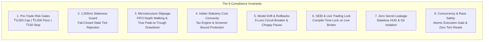

# SERQ QUANTITATIVE & RISK COMPLIANCE SPECIFICATION
## Technical Verification Guide & Auditor Test Harness

**Document Version:** `1.2.0-REVISED (Post-Independent-Audit Hardened)`  
**System Target:** SerQ Institutional NIFTY Options Arbitrage & Real-Time Trading Engine  
**Repository Location:** `/root/nifty-options-arbitrage`  
**GitHub Remote:** `https://github.com/radhika13rai/nifty-options-arbitrage`  
**Git Branch:** `main`  
**Supported Runtime:** Python >= 3.10 (Tested on Python 3.11, 3.12, 3.13, 3.14)  
**Dependencies:** Pure-Python (`starlette>=0.46.0`, `uvicorn>=0.30.0`, `websockets>=13.0.0`, `httpx>=0.27.0`, `anyio>=4.0.0`, `pytest>=8.0.0`) — zero compiled C/C++ wheels.  
**Classification:** Analytical Research Station & Paper Trading Daemon (Paper V1/V2) — **Live Broker Permanently Locked**

---

> [!IMPORTANT]
> **Independent Audit Notice:** This specification is an internal technical test harness and verification guide provided for external inspection. It incorporates empirical evaluation and remediation directives from the independent systems audit report ([`research/independent_empirical_audit.md`](file:///root/nifty-options-arbitrage/research/independent_empirical_audit.md)). Independent auditors must clone the repository in an isolated clean-room environment and execute the test procedures described herein.

---

## 1. System Architecture & Objectives

SerQ is an asynchronous, event-driven trading workstation engineered specifically for **single-lot micro-capital options trading** under an uncompromising **₹3,000 account capital constraint**. It combines:
1. **Deterministic Micro-Capital Pre-Trade Risk Engine:** Mathematical validation enforcing a hard ₹2,000 capital floor, a ₹150 stop loss, single-leg options outlays ($\le ₹38.00$), and atomic execution gates eliminating check-then-act race windows.
2. **Microstructure Slippage & Fee Engine:** Models real-world Indian statutory taxes and fee convexity (2.13% to 7.50% drag inside screener bounds; up to 36.53% on sub-₹10 options) and Level-2 orderbook queue walking with adverse selection.
3. **Adaptive Machine Learning Strategy:** Online Recursive Least Squares (RLS) and Bayesian Thompson Sampling with automated drift rollbacks.
4. **Multimodal Macro Fusion:** Ingests Brent crude, DXY, GIFT Nifty gap, and geopolitical news embeddings.
5. **Real-Time Mobile-First HUD:** Low-latency (<250ms) Starlette ASGI and WebSocket telemetry interface.

---

## 2. What to Audit: The 8 Core Invariants



### Invariant 1: Pre-Trade Risk Controls (`risk/engine.py`, `risk/kill_switch.py`)
* **Capital Floor Enforcement:** Cash balance must never breach ₹2,000.00. If cash $< ₹2,000$, all further orders must be immediately blocked.
* **Max Premium Cap:** Option entry premium must be $\le ₹38.00$ (max capital outlay $\le ₹2,470$ for 65 units), ensuring $> ₹530$ liquid cash headroom.
* **Per-Trade Stop Loss:** Hard-capped at ₹150.00 (~2.30 points).
* **Max Daily Loss:** Hard-capped at ₹300.00.
* **Lot Size Invariant:** All orders must specify exactly 65 units (1 lot). Any order with quantity $\ne 65$ or lots $> 1$ must be rejected.
* **Latching Kill Switch & Reset Protocol:** Engaging the kill switch transitions state in $< 1\,\mu\text{s}$ and latches permanently. Resetting requires HMAC-SHA256 signature verification (`hmac.compare_digest`) or an authorized confirmation token (`CONFIRM_RESET`), evaluated in constant-time to eliminate timing side-channel vulnerabilities.

### Invariant 2: Fail-Closed Staleness Guard (`risk/stale_data_guard.py`)
* Market ticks with latency $> 1,500\,\text{ms}$ or missing orderbooks (`age_ms = inf`) must be dropped immediately. Orders relying on stale ticks must be rejected.

### Invariant 3: Realistic Microstructure Slippage & Drawdown Accounting (`costs/slippage.py`, `portfolio/pnl.py`, `simulation/soak_runner.py`)
* Fills must never be granted unrealistically at Mid-Price or LTP.
* The paper broker must simulate:
  1. FIFO Queue Priority (60% depth ahead of retail orders).
  2. Level-2 orderbook depth walking (VWAP execution).
  3. Adverse selection penalty in fast-moving regimes.
  4. Book exhaustion penalty of 1.50 points on depleted depth.
* **Peak-to-Trough Drawdown Accounting:**
  $$\text{Peak}_t = \max_{0 \le \tau \le t}(\text{Equity}_\tau)$$
  $$\text{Drawdown}_t = \frac{\text{Peak}_t - \text{Equity}_t}{\text{Peak}_t} \times 100$$
  $$\text{MaxDrawdown}_T = \max_{0 \le t \le T}(\text{Drawdown}_t)$$
  The maximum drawdown reflects the true historical peak-to-trough decline across all daily equity points, and is NEVER cleared or overwritten when equity reaches subsequent new highs.

### Invariant 4: Statutory Transaction Cost Schedule & Cost Convexity (`costs/transaction_costs.py`, `analytics/strike_screener.py`)
* The system models exact Indian 2026 derivative regulatory taxes:
  - **Securities Transaction Tax (STT):** 0.1% on exercise value or 0.0625% on option premium turnover (sell side).
  - **Brokerage:** ₹20.00 flat per executed order.
  - **Exchange Turnover Charges:** 0.0505% on premium turnover.
  - **SEBI Turnover Charges:** ₹10 per crore (0.0001%).
  - **Goods and Services Tax (GST):** 18% on (Brokerage + Exchange Charges + SEBI charges).
  - **Stamp Duty:** 0.003% on buy side.
* **Statutory Friction Convexity:** Flat brokerage creates significant cost convexity on cheap options. While round-trip friction at the ₹38.00 baseline is ₹52.66 (2.13% of outlay), friction at ₹2.00 is ₹47.49 (36.53% of outlay!).
* **Screener Bound Protection:** To protect micro-capital accounts from deep-OTM friction traps, `StrikeScreener` strictly enforces `min_premium_inr = 10.00` and `max_premium_inr = 38.00`, confining all executions to a high-efficiency corridor (friction drag between 2.13% and 7.50%).

### Invariant 5: Model Drift Guard & Regime Discipline (`ml/drift_guard.py`, `ml/learner.py`)
* **Overfitting / Drift Guard:** If the strategy experiences 3 consecutive losses, parameter weights automatically roll back to the previous stable checkpoint.
* **Choppy Market Stand-Down:** In `CHOPPY_CONSOLIDATION` regimes, the learner stands down (0 trades) to avoid theta decay traps.

### Invariant 6: Permanent Live Trading Lock (`execution/live_broker_disabled.py`)
* Live execution pathways raise compile-time and runtime `RuntimeError` exceptions (`LiveTradingPermanentlyDisabledError`) to prevent accidental live execution.

### Invariant 7: Zero Secret Leakage & Telemetry Transparency (`broker/`, `dashboard/`, `serq`)
* Zero credentials, broker API keys, or private keys committed to git or exposed to the browser HUD.
* Uncalibrated Bayesian prior defaults (such as a 50.0% prior win rate or 0.150 pts baseline slippage) are explicitly labeled as `N/A (Prior Default — 0 samples)` until live orders are recorded.

### Invariant 8: Concurrency & Race Condition Safety (`risk/kill_switch.py`, `execution/paper_broker.py`, `database/db.py`)
* **Thread-Safe Kill Switch:** Internal mutations and status queries are protected by `threading.RLock`, guaranteeing zero torn reads under multi-threaded contention.
* **Atomic Execution Gate:** Order validation, pre-trade risk checks, and portfolio cash/position mutation are bound by `kill_switch.atomic_execution_gate()`. This strictly eliminates the check-then-act race window, guaranteeing 0 orders can be approved or filled when the kill switch is engaged.
* **SQLite WAL Write Serialization:** Background database writes are serialized via an internal write lock, eliminating `database is locked` operational errors under concurrent multi-threaded workloads.

---

## 3. How to Audit: Step-by-Step Auditor's Playbook

All verification steps are self-contained and run via the unified `./serq` CLI:

```bash
git clone https://github.com/radhika13rai/nifty-options-arbitrage.git
cd nifty-options-arbitrage
pip install -r requirements.txt
```

### Audit Step 1: Execute Full Test Suite
Verifies that all 119 unit, integration, and concurrency tests across 21 test modules pass:
```bash
./serq test
# Alternatively: python3 -m pytest tests/ -v
```
**Expected Audit Result:** `119 passed (100% pass rate)`.

---

### Audit Step 2: Run Adversarial Stress & Risk Gate Audit
Simulates severe market shocks, false breakouts, and capital floor breaches:
```bash
./serq stress
```
**Expected Audit Result:**
- Phase 1: 3 consecutive false breakouts trigger `ModelDriftGuard` rollback.
- Phase 2: Cash simulated below ₹2,000 floor immediately engages latching Kill Switch.
- Phase 3: 100% of subsequent order attempts hard-blocked with `REJECTED`.
- Phase 4: HMAC-SHA256 signature verification validates reset protocol.
- **Verdict:** `PASSED (100% INVARIANTS HELD)`.

---

### Audit Step 3: Inspect AI Model Drift & Telemetry
Verifies rolling win rate, Sharpe ratio, and consecutive loss counters:
```bash
./serq drift
```
**Expected Audit Result:**
- Uncalibrated priors labeled `N/A (Prior Default — 0 trades analyzed)`.
- `Guard Invariant: Zero statistical drift detected`.

---

### Audit Step 4: Run Multi-Path Monte Carlo Stress Analysis
Auditors should test multi-path stochastic simulations across independent random seeds rather than relying on a single deterministic seed:
```bash
# Run 5 independent paths of 10 days each
./serq monte-carlo 5 10

# Run a single stochastic soak test with random seed
./serq soak 20 0.01 random

# Run reproducible deterministic regression with specific seed
./serq soak 20 0.01 42
```
**Expected Audit Result:**
- Peak-to-trough max drawdown is preserved even if the final day closes at a new high.
- Capital floor is preserved ($> ₹2,000.00$) across all paths.

---

### Audit Step 5: Verify Microstructure Slippage Engine
Inspects queue simulation and execution drag telemetry:
```bash
./serq slippage
```
**Expected Audit Result:**
- Uncalibrated state labeled `N/A (Config Prior — 0 fills analyzed)`.
- FIFO queue priority: 60% depth ahead.
- Depth walking: Enabled.
- Adverse selection drag: Enabled.

---

### Audit Step 6: Verify Black-Scholes Greeks & Strike Screener
Tests analytical pricing engine and micro-capital strike screener:
```bash
# Greeks pricing test (Spot 24500, Strike 24700, 4 days, 15.5% IV, CE)
./serq greeks 24500 24700 4 0.155 CE

# Screener test (Spot 24500, Bullish bias, 4 days, 15.5% IV)
./serq screener 24500 BULLISH 4 0.155
```
**Expected Audit Result:**
- Strike Screener selects optimal contract with premium $\le ₹38.00$ and capital outlay $\le ₹2,470.00$.

---

### Audit Step 7: Scan Codebase for Secret & Credential Leakage
Audits repository files and git history for API keys, tokens, and private keys:
```bash
python3 -c "
import os, re
patterns = [
    r'(?i)(?:api_key|apikey|secret|token|password|bearer|auth|private_key)\s*[:=]\s*[\'\"][a-zA-Z0-9_\-\.]{16,}[\'\"]',
    r'ghp_[a-zA-Z0-9]{36}',
    r'ey[a-zA-Z0-9_\-]{20,}\.[a-zA-Z0-9_\-]{20,}',
    r'-----BEGIN (?:RSA |EC |DSA )?PRIVATE KEY-----'
]
leaks = sum(1 for root, _, files in os.walk('.') if not any(x in root for x in ['.git', '__pycache__', '.pytest_cache']) for f in files if f.endswith(('.py','.html','.js','.sh','.json','.sql','.yaml')) for p in patterns if re.search(p, open(os.path.join(root, f), errors='ignore').read()))
print(f'AUDIT SCAN VERDICT: {leaks} leaks detected.')
"
```
**Expected Audit Result:** `AUDIT SCAN VERDICT: 0 leaks detected.`

---

### Audit Step 8: Verify Live Daemon & Streaming Feed
Validates background server startup, WebSocket streaming, and graceful shutdown:
```bash
# Start background server
./serq start

# Check real-time telemetry
./serq status

# Check market feed ingestion & latency
./serq feed

# Gracefully stop server
./serq stop
```
**Expected Audit Result:**
- Daemon starts cleanly on `http://localhost:8000/`.
- Health check returns `HEALTHY`.
- Latency reported $< 250\,\text{ms}$.
- Graceful stop frees port `8000`.

---

### Audit Step 9: Verify Concurrency & Race Condition Safety
Audits multi-threaded kill-switch toggling, atomic execution gates, and SQLite WAL write serialization:
```bash
python3 -m pytest tests/test_concurrency_race.py -v
```
**Expected Audit Result:**
- `test_kill_switch_torn_read_and_concurrency`: 0 torn reads across thousands of iterations under continuous engage/reset cycling.
- `test_atomic_execution_gate_eliminates_check_then_act_race`: 0 check-then-act race violations; 0 orders approved or filled while kill switch is engaged.
- `test_concurrent_sqlite_wal_writes`: 500 concurrent writes across 10 threads completed with 0 errors.
- `test_paper_broker_concurrent_kill_switch_safety`: 0 broker orders filled while kill switch is engaged.
- **Verdict:** `4 passed in ~20s (100% pass rate)`.

---

## 4. Auditor Evidence Log Locations

| Component | Audit Artifact / Log File | Description |
| :--- | :--- | :--- |
| **Independent Systems Audit** | `research/independent_empirical_audit.md` | Full empirical audit evaluating SerQ |
| **Test Results** | `.pytest_cache/` | Complete Pytest execution state (119 tests) |
| **Daemon Server Logs** | `logs/serq.log` | Raw application and WebSocket logs |
| **Audit Trail DB** | `database/arbitrage.db` | SQLite WAL ledger of all orders & transitions |
| **Executive Charter** | `cto/master_executive_charter.md` | Formal CTO Governance & SEBI Charter |
| **Security Audit** | `research/security_audit.md` | Secrets and credential isolation spec |
| **Engineering Audit** | `research/engineer_audit.md` | Latency, memory safety, and proofs |

---

## 5. Auditor Verification Worksheet

This worksheet is provided for independent auditors to record their findings upon completing the audit protocol:

```
┌────────────────────────────────────────────────────────────────────────────┐
│                    SERQ AUDITOR VERIFICATION WORKSHEET                     │
├────────────────────────────────────────────────────────────────────────────┤
│ Auditor Name / Firm: ____________________________________________________  │
│ Audit Date:          ____________________________________________________  │
│ Target Commit Hash:  ____________________________________________________  │
│ Python Environment:  ____________________________________________________  │
├────────────────────────────────────────────────────────────────────────────┤
│ INVARIANT VERIFICATION CHECKLIST:                                          │
│                                                                            │
│ [ ] Step 1: Full Test Suite (119 tests passing, 0 failures)                │
│ [ ] Step 2: Adversarial Stress & Floor Breach (Kill switch engaged)        │
│ [ ] Step 3: Model Drift Telemetry (Clear labeling of priors)               │
│ [ ] Step 4: Multi-Path Monte Carlo / Peak-to-Trough Drawdown Preserved     │
│ [ ] Step 5: Microstructure Slippage & FIFO Queue Modeling                  │
│ [ ] Step 6: Black-Scholes Greeks & Strike Screener (≤ ₹38 Cap)             │
│ [ ] Step 7: Zero Credential Leakage Scan (0 leaks)                         │
│ [ ] Step 8: Daemon Lifecyle & WebSocket Feed (Clean shutdown)              │
│ [ ] Step 9: Concurrency & Race Safety (0 torn reads, 0 check-then-act)     │
├────────────────────────────────────────────────────────────────────────────┤
│ Auditor Signature:   ____________________________________________________  │
│ Certification Status: [ ] APPROVED   [ ] DEFICIENCIES NOTED   [ ] REJECTED │
└────────────────────────────────────────────────────────────────────────────┘
```
