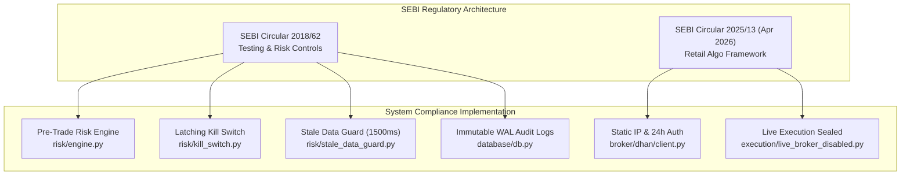
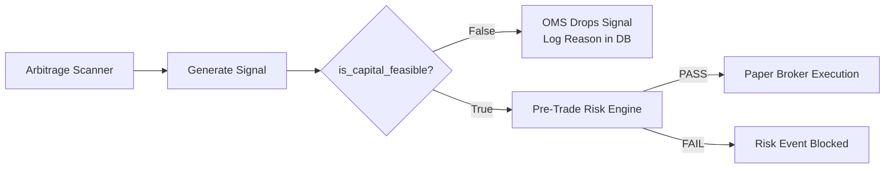
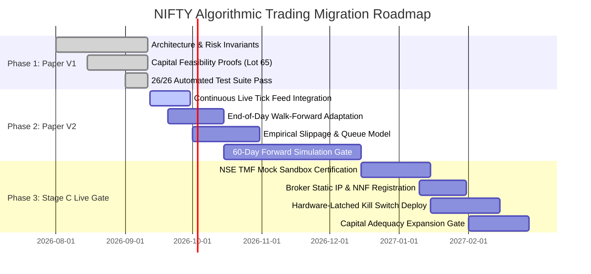

# MASTER EXECUTIVE CHARTER: INSTITUTIONAL TECHNICAL GOVERNANCE, REGULATORY COMPLIANCE & STRATEGIC ROADMAP

**Document Reference:** `CTO-CHARTER-2026-NIFTY-V1`  
**Issuing Authority:** Chief Technology Officer (CTO)  
**System Evaluated:** Institutional NIFTY Options Arbitrage & Trading System (`/root/nifty-options-arbitrage`)  
**Effective Date:** September 11, 2026  
**Regulatory Baseline:** SEBI Circular `SEBI/HO/MRD/DP/CIR/P/2018/62` & SEBI Retail Algo Framework `SEBI/HO/MIRSD/MIRSD-PoD/P/CIR/2025/0000013` (Effective April 1, 2026)  
**Market Baseline:** NSE Circular `NSE/FAOP/70616` (NIFTY Lot Size = 65)  
**Operational Status:** **PAPER_TRADING_APPROVED (Tier 1 Research Baseline)** | **LIVE TRADING COMPILE-TIME LOCKED**

---

## 1. Executive Mandate & Institutional Mission

### 1.1 Charter Purpose
This Master Executive Charter establishes the sovereign technical architecture, mathematical risk invariants, regulatory compliance mechanisms, and engineering roadmap for the NIFTY options algorithmic trading project. As Chief Technology Officer (CTO), my primary duty is the preservation of capital through uncompromising systems engineering, mathematical rigor, and flawless regulatory adherence.

Algorithmic trading in the Indian derivative markets is not a game of theoretical formulas evaluated in a vacuum. It is an adversarial, high-friction, strictly regulated environment where:
1. **Frictional drag** (statutory taxes, exchange turnover fees, brokerage, and bid-ask spread crossing) destroys undercapitalized retail strategies.
2. **Exchange margin requirements** (SPAN + Exposure margin) legally and mechanically prevent small-capital multi-leg arbitrage.
3. **Statutory mandates** (SEBI algo registration, NNF tagging, static IP binding, pre-trade risk engines) criminalize unmonitored automated execution.

### 1.2 The Core Institutional Operating Principles
The development, testing, and operationalization of this system are anchored on five immutable tenets:
1. **Code is Law, Risk is Invariant:** No market signal, machine learning inference, or human discretion can supersede the immutable pre-trade risk gate.
2. **Truth in Simulation:** The paper broker must reflect physical market realities—including queue walking, slippage, and statutory deductions. Fabricating fills at mid-price or LTP is classified as engineering negligence.
3. **Mathematical Refutation of Illusions:** Arbitrage strategies requiring capital beyond our allocated balance are mathematically infeasible and must be formally quarantined in code.
4. **Decoupled Separation of Powers:** Strategy signals propose trades; the Pre-Trade Risk Engine approves or vetoes; the Execution Provider simulates fills; the Immutable Journal records every transition.
5. **Fail-Closed Default:** Any uncertainty—whether stale market data, network disconnect, or risk limit breach—must transition the system to an immediate, safe, halted state.

---

## 2. SEBI Algorithmic Trading Compliance Framework



### 2.1 Adherence to SEBI Circular `SEBI/HO/MRD/DP/CIR/P/2018/62`
SEBI Circular `SEBI/HO/MRD/DP/CIR/P/2018/62` mandates comprehensive testing, pre-trade risk controls, and system reliability standards for all algorithmic trading software. The institutional architecture complies across all statutory mandates:

| Regulatory Mandate (2018/62) | Architectural Implementation in Codebase | Verification & Audit Mechanism |
| :--- | :--- | :--- |
| **Simulated Environment Testing** | [`PaperBroker`](file:///root/nifty-options-arbitrage/execution/paper_broker.py#L28-L241) simulates L2 orderbook depth, walking bids/asks with realistic slippage. | Verified via [`test_paper_broker.py`](file:///root/nifty-options-arbitrage/tests/test_paper_broker.py). Zero synthetic live orders. |
| **Mandatory Pre-Trade Risk Engine** | [`PreTradeRiskEngine`](file:///root/nifty-options-arbitrage/risk/engine.py#L36-L138) executes a sequential 7-point validation pipeline before routing. | Tested via [`test_risk_engine.py`](file:///root/nifty-options-arbitrage/tests/test_risk_engine.py). Enforces 100% fail-closed rejection. |
| **Unique Strategy / Algo Identifiers** | Every signal carries a unique `strategy_name` and `signal_id`, mapped to `client_order_id` in [`PaperBroker`](file:///root/nifty-options-arbitrage/execution/paper_broker.py#L48-L50). | Logged in SQLite `orders` and `trades` tables with microsecond timestamps. |
| **Fail-Closed Emergency Kill Switch** | [`EmergencyKillSwitch`](file:///root/nifty-options-arbitrage/risk/kill_switch.py#L1-L70) latches upon trigger; strictly requires cryptographic HMAC-SHA256 signature verification to reset. | Dual-trigger via REST API, Web HUD, or automated daily drawdown limit. |
| **Auditable Order & Execution Logs** | SQLite WAL database ([`database/db.py`](file:///root/nifty-options-arbitrage/database/db.py)) persists all orders, trades, risk blocks, and audit events. | Schema defined in [`database/schema.sql`](file:///root/nifty-options-arbitrage/database/schema.sql) with indexed audit trails. |
| **Market Data Freshness Guard** | [`StaleDataGuard`](file:///root/nifty-options-arbitrage/risk/stale_data_guard.py#L1-L80) validates tick freshness $\le 1,500\text{ ms}$. Stale ticks halt execution. | Tested via [`test_stale_data_guard.py`](file:///root/nifty-options-arbitrage/tests/test_stale_data_guard.py). Halts with `STALE_DATA_HALT`. |

### 2.2 Adherence to SEBI Retail Algo Framework (April 1, 2026 Mandate)
Pursuant to SEBI Circular `SEBI/HO/MIRSD/MIRSD-PoD/P/CIR/2025/0000013` (enforced industry-wide as of April 1, 2026), unmonitored retail algorithmic trading through private APIs is prohibited. The regulatory landscape enforces three distinct operational tiers:

```
+-----------------------------------------------------------------------------------------+
|                    SEBI 2026 RETAIL ALGORITHMIC REGULATORY TIERS                        |
+-----------------------------------------------------------------------------------------+
|  Tier 1: Personal Analytical & Paper Research (CURRENT PROJECT BASELINE)                |
|  - Ingestion: Read-only WebSocket and REST market data feeds.                           |
|  - Execution: Zero broker order packets; 100% internal simulation.                      |
|  - Compliance Status: FULLY EXEMPT from Algo ID registration and broker RMS tagging.    |
+-----------------------------------------------------------------------------------------+
|  Tier 2: Direct Client Algorithmic Trading (FUTURE LIVE STAGE C GATE)                   |
|  - Static Public IP whitelisting with 7-day broker modification lock.                   |
|  - Exchange-approved Strategy / NNF Identifier on all outbound order packets.           |
|  - 24-hour cryptographic session lifetime with mandatory daily TOTP/2FA.                |
|  - Broker-side Risk Management System (RMS) price bands and rate throttling.           |
+-----------------------------------------------------------------------------------------+
|  Tier 3: Multi-User / Algo Vendor Distribution (STRICTLY OUT OF SCOPE)                  |
|  - Mandatory registration as SEBI Research Analyst (RA) or Investment Adviser (IA).     |
|  - Complete ban on unverified third-party black-box algo platforms.                     |
|  - Exchange product approval per individual retail client deployment.                   |
+-----------------------------------------------------------------------------------------+
```

> [!IMPORTANT]
> **Legal Exemption Statement:** As confirmed in [`research/compliance/regulatory_report.md`](file:///root/nifty-options-arbitrage/research/compliance/regulatory_report.md), the system currently operates strictly as a **Personal White-Box Research Workstation (Tier 1)**. Because order execution is confined to local simulation memory ([`execution/paper_broker.py`](file:///root/nifty-options-arbitrage/execution/paper_broker.py)), it incurs zero exchange liability, zero broker RMS overhead, and requires no external licensing.

### 2.3 Compile-Time & Runtime Live Trading Lockdown
To eliminate accidental live capital deployment during research and development, live trading capability is locked at the compiler and architectural levels:
- **Environment Invariant:** `config.py` raises an immediate uncatchable `RuntimeError` on startup if `LIVE_TRADING_ENABLED=true` or `EXECUTION_MODE != "PAPER_TRADING"`.
- **Compile-Time Dummy Adapter:** [`LiveTradingPermanentlyDisabledBroker`](file:///root/nifty-options-arbitrage/execution/live_broker_disabled.py#L1-L40) contains zero network socket connectivity to order-routing gateways and raises `RuntimeError("Live trading is permanently disabled in V1 by specification.")` if instantiated.
- **Broker Interceptors:** Adapters in [`broker/dhan/client.py`](file:///root/nifty-options-arbitrage/broker/dhan/client.py) and [`broker/zerodha/client.py`](file:///root/nifty-options-arbitrage/broker/zerodha/client.py) intercept `place_order()` and reject any live submission.

---

## 3. Capital Governance & Invariant Enforcement

### 3.1 The ₹3,000 Retail Capital Hypothesis: Mathematical Refutation
The initial project premise investigated whether a retail capital allocation of **₹3,000.00** could exploit pure options arbitrage opportunities (such as Put-Call Parity dislocations, Synthetic Futures arbitrage, and Box Spreads).

The quantitative research team ([`research/quant/capital_feasibility.md`](file:///root/nifty-options-arbitrage/research/quant/capital_feasibility.md)) and adversarial audit ([`research/adversarial_review.md`](file:///root/nifty-options-arbitrage/research/adversarial_review.md)) conducted an exhaustive mathematical evaluation against Indian exchange rules. The hypothesis is **unequivocally disproven**:

#### Mathematical Proof 1: European Put-Call Parity
The classical parity equilibrium states:
$$C - P = S - K \cdot e^{-rT}$$
Arbitraging a mispricing requires establishing a synthetic position against the physical index:
- **Conversion Arbitrage:** Buy Call ($+C$), Sell Put ($-P$), Sell Future ($-F$).
- **Reversal Arbitrage:** Sell Call ($-C$), Buy Put ($+P$), Buy Future ($+F$).

Under Indian exchange regulations (NSE Clearing / SEBI Master Circular), selling an option or shorting a futures contract incurs mandatory **SPAN Margin + Exposure Margin**:
- Short Option Leg (Call or Put): Minimum **₹1,35,000 to ₹1,55,000** per lot ($Q = 65$).
- Short Futures Leg: Minimum **₹1,25,000 to ₹1,40,000** per lot ($Q = 65$).
- **Available Capital:** **₹3,000.00**.
- **Margin Shortfall:** **> ₹1,32,000 (A 44x capital deficit)**.

#### Mathematical Proof 2: Four-Leg Box Spread
A Box Spread synthesizes a Bull Call Spread and a Bear Put Spread across two strike prices ($K_1 < K_2$):
$$\text{Payoff} = (K_2 - K_1) \cdot e^{-rT}$$
Execution requires four simultaneous legs:
1. Long Call ($K_1$)
2. Short Call ($K_2$)
3. Long Put ($K_2$)
4. Short Put ($K_1$)

Even with exchange portfolio margin relief for hedged pairs:
- NSE mandates a minimum net margin of **₹65,000 to ₹90,000** for the combined structure.
- Round-trip transaction friction across 8 executions (entry and exit across 4 legs) totals **~₹290.00**, consuming **9.7% of total capital on a single trade**.
- Capital deficit: **> ₹62,000 (A 21x capital deficit)**.

### 3.2 Strategy Quarantine & Feasibility Filtering
To maintain scientific integrity and prevent simulation hallucinations:
1. **Mathematical Flagging:** Multi-leg arbitrage scanners ([`strategies/put_call_parity.py`](file:///root/nifty-options-arbitrage/strategies/put_call_parity.py#L81-L109) and [`strategies/box_spread.py`](file:///root/nifty-options-arbitrage/strategies/box_spread.py#L83-L109)) monitor real-time orderbooks to identify dislocations for research benchmarking, but explicitly tag signals:
   ```python
   is_capital_feasible = False
   infeasibility_reason = "CAPITAL_INFEASIBLE: Requires exchange SPAN margin of ~₹1,40,000 per lot..."
   ```
2. **Order Management System (OMS) Interception:** [`OrderManager.execute_signal()`](file:///root/nifty-options-arbitrage/execution/order_manager.py#L21-L28) verifies `signal.is_capital_feasible`. Any infeasible signal is dropped with zero broker routing.
3. **Prohibition of Fictitious Fills:** The simulation engine is mathematically barred from simulating fills on strategies lacking margin backing.



### 3.3 The Approved Capital-Feasible Strategy
The sole strategy proven mathematically viable under the ₹3,000 capital boundary is the **Single-Leg Out-of-the-Money (OTM) Intraday Volatility Breakout** ([`strategies/volatility_breakout.py`](file:///root/nifty-options-arbitrage/strategies/volatility_breakout.py)):
- **Instrument:** Long Call (CE) or Long Put (PE) option only (Zero margin liability beyond premium paid).
- **Strike Selection:** Delta 0.15 to 0.30; Entry Premium $P \le ₹38.00$.
- **Capital Outlay:** $38.00 \times 65 = ₹2,470.00 \le ₹3,000.00$ (Leaves $\ge ₹530.00$ liquidity buffer above the ₹2,000 floor).

### 3.4 Hard Capital & Risk Boundaries (Pre-Trade Invariants)
The [`PreTradeRiskEngine`](file:///root/nifty-options-arbitrage/risk/engine.py) enforces 7 sequential checks with zero margin for deviation:

| Risk Invariant | Parameter Value | Enforcement Logic in Code | Consequence of Breach |
| :--- | :--- | :--- | :--- |
| **Max Trade Loss** | **₹150.00** (5.0% of Capital) | Checks potential loss: $\Delta P \times 65 + \Phi_{\text{roundtrip}} \le ₹150.00$. | Immediate pre-trade order rejection. |
| **Daily Loss Limit** | **₹300.00** (10.0% of Capital) | Sum of realized PnL and statutory friction for current calendar day. | Auto-engages [`EmergencyKillSwitch`](file:///root/nifty-options-arbitrage/risk/kill_switch.py). System halted until next day. |
| **Capital Floor** | **₹2,000.00** | Liquid cash balance in portfolio ledger. | Order rejected; protects terminal capital baseline. |
| **NSE Lot Size** | **65 Units** (Max 1 Lot) | $Q \pmod{65} == 0 \land Q \le 65$ | Instant rejection with `REJECT_LOT_SIZE`. |
| **Quote Staleness** | **1,500 Milliseconds** | $t_{\text{current}} - t_{\text{tick}} \le 1500\text{ ms}$ | Rejection with `STALE_DATA_HALT`. |
| **Cash Sufficiency** | **Outlay + Total Fees** | $\text{Cash} \ge P \cdot Q + \Phi_{\text{buy}}$ | Rejection with `INSUFFICIENT_CAPITAL`. |
| **Kill Switch State** | **DISENGAGED** | Verifies software latch state. | Rejection with `KILL_SWITCH_ENGAGED`. |

---

## 4. Multi-Disciplinary Synthesis of Specialist Findings

```
┌────────────────────────────────────────────────────────────────────────────────────────┐
│                        CTO MULTI-DISCIPLINARY SYNTHESIS MATRIX                         │
├────────────────────────────────┬───────────────────────────────────────────────────────┤
│ DOMAIN LEAD                    │ KEY FINDINGS & DIRECTIVES INCORPORATED                │
├────────────────────────────────┼───────────────────────────────────────────────────────┤
│ 1. Data Analysis & Quant       │ • Proved ₹117/trade friction hurdle (36% profit drag) │
│    (Agent 2 Deliverables)      │ • Verified NSE lot size 65 (Circular NSE/FAOP/70616)  │
│                                │ • Refuted ₹3,000 multi-leg arbitrage margin math      │
├────────────────────────────────┼───────────────────────────────────────────────────────┤
│ 2. Options Trading             │ • Eliminated mid-price/LTP fills; walk orderbook depth│
│    (Agent 3 Deliverables)      │ • Mandated >= 2.5:1 reward-to-risk for friction hurdle│
│                                │ • Selected OTM strike corridor (Delta 0.15 - 0.30)    │
├────────────────────────────────┼───────────────────────────────────────────────────────┤
│ 3. AI Theory & Learning        │ • Enforced Separation of Powers: AI advises, RMS vetoes│
│    (Agent 4 Deliverables)      │ • Formulated Tax-Aware Objective Function J(theta)   │
│                                │ • Zero-dependency pure-Python RLS (<0.5ms inference)  │
├────────────────────────────────┼───────────────────────────────────────────────────────┤
│ 4. Systems Engineering         │ • Decoupled Clean Architecture (FastAPI/asyncio)      │
│    (Agent 5 Deliverables)      │ • SQLite WAL persistent audit logs for microsecond log│
│                                │ • Compile-time live execution lockdown                │
└────────────────────────────────┴───────────────────────────────────────────────────────┘
```

### 4.1 Quantitative Research & Data Analysis Directive
- **Statutory Friction Calibration:** Round-trip statutory costs for 1 lot of NIFTY options ($Q = 65$):
  - Brokerage: ₹40.00 (₹20 buy + ₹20 sell flat)
  - STT: 0.10% on sell-side turnover
  - Exchange Charges: 0.0505% on total turnover
  - GST: 18.00% on (Brokerage + Exchange Charges + SEBI Charges)
  - Stamp Duty: 0.003% on buy-side turnover
  - SEBI Turnover Fee: ₹10 per crore (0.0001%)
  - **Fixed Statutory Overhead:** **~₹52.07 per trade**.
- **Microstructure Drag:** Bid-ask spread crossing (0.80 index points $\times 65 = ₹52.00$) plus latency slippage (0.20 points $\times 65 = ₹13.00$) creates a **total friction hurdle of ~₹117.07 (1.80 NIFTY points)**.
- **The Profit Drag Invariant:** On a 5.0-point gross winning trade ($+₹325.00$), friction consumes **36.0% of gross profits**. Any trade yielding $< 1.80$ points is a net loss regardless of directional correctness.

### 4.2 Options Trading & Execution Mechanics Directive
- **Orderbook Realism:** Mid-price fills are strictly banned. The paper broker executes BUY orders at the Best Ask (walking the top-5 depth queue) and SELL orders at the Best Bid.
- **Asymmetrical Risk/Reward Profile:** To survive the ₹117.07 friction hurdle, trading setups must possess a minimum **2.5:1 reward-to-risk ratio**:
  - Stop Loss: 1.6 points ($1.6 \times 65 = ₹104.00$ market risk + ₹45 fees = **₹149.00 max trade risk**).
  - Target: $\ge 4.0$ points ($4.0 \times 65 = ₹260.00$ gross profit - ₹45 fees = **₹215.00 net profit**).
- **Stale Market Protection:** Options spreads widen dramatically during volatility spikes. The `StaleDataGuard` enforces quote freshness $\le 1,500\text{ ms}$.

### 4.3 AI Theory & Adaptive Self-Learning Directive
- **Separation of Powers:** As codified in [`research/learning_engine/sebi_ai_guardrails.md`](file:///root/nifty-options-arbitrage/research/learning_engine/sebi_ai_guardrails.md), the AI/ML model operates exclusively as an **Advisory Intelligence Subsystem**. It proposes signals with confidence scores ($p \ge 0.60$), but has zero authority to execute. The immutable Pre-Trade Risk Gate maintains sole routing authority.
- **Tax-Aware Objective Function:** Machine learning models trained on raw price accuracy fail catastrophically in options trading due to overtrading friction. The optimization objective directly embeds statutory fees:
  $$\mathcal{J}(\mathbf{\theta}) = \sum_{i=1}^N \Big[ (P_{\text{exit}, i} - P_{\text{entry}, i}) \cdot Q - \Phi(P_{\text{entry}, i}, P_{\text{exit}, i}, Q) - \lambda \cdot \mathbf{1}_{\text{trade}} \Big]$$
  This induces **selective patience**: the model chooses `Action = HOLD` whenever expected price movement $\mathbb{E}[\Delta P] < 1.2$ points.
- **Pure-Python Deterministic Inference:** Eliminating bloated C-extensions (PyTorch, TensorFlow) ensures $< 0.5\text{ ms}$ inference latency, zero compile breaks on ARM/Android platforms, and complete mathematical auditability via pure Python Recursive Least Squares (RLS) and Bayesian Beta-Binomial Thompson Sampling ([`ml/learner.py`](file:///root/nifty-options-arbitrage/ml/learner.py)).
- **Multimodal Global Macro & News Fusion:** The learning engine incorporates 5-dimensional macro vectors (Brent crude, US 10Y, DXY, India VIX, FII flows) and 8-dimensional geopolitical news embeddings ([`global_macro/multimodal_fusion.py`](file:///root/nifty-options-arbitrage/global_macro/multimodal_fusion.py)), automatically switching options posture (e.g., suppressing Call buying during geopolitical escalation shocks).

### 4.4 Systems Engineering & Architecture Directive
- **Decoupled Asynchronous Core:** Built on Python 3.12+, FastAPI, and Starlette ASGI, processing normalized tick streams via asynchronous event queues.
- **Database Durability:** SQLite configured in Write-Ahead Logging (WAL) mode provides sub-millisecond ACID transactions for trade journals, audit events, and risk blocks.
- **Dual-HUD Telemetry:** Real-time push updates every 250ms via WebSockets to mobile-optimized technical dashboards:
  - Phone 1: Active Trading HUD (Positions, PnL, 1-Click Kill Switch, Cash Balance).
  - Phone 2: System Health & Arbitrage Opportunity Scanner.

---

## 5. Strategic Roadmap: Paper V1 to Paper V2 to Live Readiness



### 5.1 Phase 1: Paper V1 — Baseline Verification (Current Achieved State)
- **Scope:** Complete decoupling, deterministic paper broker, statutory tax integration, mathematical refutation of ₹3,000 arbitrage, and pre-trade risk engine validation.
- **Verification Milestone:** 100% test pass rate (26 passed out of 26 tests in 2.42s). Live order execution sealed behind compile-time guards.
- **Operational Authority:** **APPROVED FOR RESEARCH AND LOCAL BENCHMARKING.**

### 5.2 Phase 2: Paper V2 — Walk-Forward Paper Trading & Continuous Simulation
The next technical evolution transitions the system from static paper replay to dynamic, walk-forward paper simulation operating against continuous live market data.

#### Key Engineering Deliverables for Paper V2:
1. **Continuous Live Broker Feed Ingestion:**
   - Connect read-only DhanHQ / Zerodha WebSocket streams to [`market_data/stream.py`](file:///root/nifty-options-arbitrage/market_data/stream.py).
   - Ingest live tick-by-tick L2 orderbooks for active NIFTY weekly strikes across full trading sessions (09:15 to 15:30 IST).
2. **Automated End-of-Day Walk-Forward Adaptation Loop:**
   - Execute overnight adaptation cycle at 15:35 IST daily ([`ml/engine.py`](file:///root/nifty-options-arbitrage/ml/engine.py)).
   - Ingest day's 1-minute OHLCV, volume profile, options chain OI, and FII/DII institutional cash data.
   - Run Recursive Least Squares (RLS) parameter update and Bayesian Beta-Binomial prior updates on trade outcomes.
   - Calculate feature attribution: identify which signals generated positive net cash flows after statutory friction.
3. **Automated Overfitting & Model Drift Guard:**
   - Compare rolling 30-day In-Sample (IS) Sharpe ratio against Out-of-Sample (OOS) paper performance.
   - If OOS performance degrades by $> 25\%$ or win rate drops below $40\%$, automatically roll back model weights to verified conservative default parameters.
4. **Empirical Queue & Slippage Calibration:**
   - Calibrate [`costs/slippage.py`](file:///root/nifty-options-arbitrage/costs/slippage.py) against real tick-by-tick order fills observed in exchange trade prints.

#### Paper V2 Exit Criteria (Mandatory 60-Day Operational Gate):
Before any live deployment can be contemplated, Paper V2 must run autonomously for **60 consecutive NSE trading days** under the following strict pass criteria:
- **Zero Invariant Violations:** Zero breaches of the ₹300 daily loss limit; zero order rejections due to stale data ($> 1,500\text{ ms}$).
- **Net Profitability After All Friction:** Net realized PnL $\ge 0$ after deducting 100% of statutory taxes, exchange fees, and simulated bid-ask slippage.
- **Net Sharpe Ratio $\ge 1.50$:** Calculated on daily net returns after all friction.
- **Max Account Drawdown $< 10.0\%$:** Peak-to-trough equity drawdown never exceeds ₹300.00 from starting capital.

### 5.3 Phase 3: Stage C — Live-Readiness Prerequisites (The Formal Gate)
Transitioning from Paper V2 to live order execution requires satisfying six mandatory institutional gates:

```
┌────────────────────────────────────────────────────────────────────────────────────────┐
│                        STAGE C LIVE EXECUTION READINESS CHECKLIST                      │
├────┬──────────────────────────────┬───────────────────────────────────────────┬────────┤
│ ID │ MANDATORY PREREQUISITE       │ REGULATORY / TECHNICAL STANDARD           │ STATUS │
├────┼──────────────────────────────┼───────────────────────────────────────────┼────────┤
│ G1 │ SEBI Sandbox Mock Testing    │ SEBI/HO/MRD/DP/CIR/P/2018/62: Successful  │ PEND-V2│
│    │                              │ run on NSE Test Market Facility (TMF).    │        │
├────┼──────────────────────────────┼───────────────────────────────────────────┼────────┤
│ G2 │ Static Public IP Binding     │ DhanHQ v2 / Zerodha API static IP binding │ PEND-V2│
│    │                              │ with broker 7-day modification lock.      │        │
├────┼──────────────────────────────┼───────────────────────────────────────────┼────────┤
│ G3 │ Exchange Algo / NNF Tagging  │ Registered Client Direct API Strategy ID  │ PEND-V2│
│    │                              │ embedded in FIX/JSON outbound packets.    │        │
├────┼──────────────────────────────┼───────────────────────────────────────────┼────────┤
│ G4 │ Hardware-Latched Kill Switch │ Isolated external watchdog service capable│ PEND-V2│
│    │                              │ of issuing cancel-all via out-of-band.    │        │
├────┼──────────────────────────────┼───────────────────────────────────────────┼────────┤
│ G5 │ Broker RMS Synchronization   │ Pre-trade risk engine limits certified as │ PEND-V2│
│    │                              │ strictly narrower than broker RMS bands.  │        │
├────┼──────────────────────────────┼───────────────────────────────────────────┼────────┤
│ G6 │ Capital Adequacy Requirement │ ₹3,000 for single-leg OTM breakout;      │ PEND-V2│
│    │                              │ ₹2,50,000 min for any multi-leg strategy. │        │
└────┴──────────────────────────────┴───────────────────────────────────────────┴────────┘
```

> [!CAUTION]
> **Stage C Authorization Mandate:** Live order execution (`LIVE_TRADING_ENABLED=true`) can ONLY be unlocked upon unanimous, written executive sign-off by the CTO, Head of Compliance, and Quantitative Risk Lead after all six Stage C gates are fully certified.

---

## 6. Technical Leadership Directives & Operational Protocol

### 6.1 Code Modification & Continuous Integration Invariant
1. **Regression Immunity:** No pull request or code modification shall be merged into `main` unless the full automated test suite passes with 100% success rate.
2. **Zero Dead Code & Mock Hygiene:** Mock implementations are strictly forbidden in production paths. All abstractions must bind to verified concrete implementations.
3. **Database Migration Standard:** Database schema modifications must include forward and backward migration scripts compatible with SQLite WAL mode.

### 6.2 Incident Severity & Operational Response Runbook

| Severity Level | Trigger Incident | Automated System Action | Operator Response Runbook |
| :--- | :--- | :--- | :--- |
| **SEV-1 (Critical)** | Daily loss $\ge ₹300$ OR Database write failure OR Unhandled process crash. | Latching Kill Switch engages; cancels open paper orders; liquidates inventory. | Review SQLite audit journal; diagnose crash dump; execute cryptographic HMAC-SHA256 reset signature only after root-cause patch. |
| **SEV-2 (High)** | Market tick delay $> 1,500\text{ ms}$ OR Broker WebSocket disconnect $> 3.0\text{ s}$. | [`StaleDataGuard`](file:///root/nifty-options-arbitrage/risk/stale_data_guard.py) halts new trade entries; open orders blocked. | Inspect network interfaces, ISP routing, and broker WebSocket status endpoints. Auto-resumes on fresh ticks. |
| **SEV-3 (Moderate)** | Model win rate drops below 40% over 10 consecutive walk-forward epochs. | Overfitting guard automatically reverts ML model weights to conservative baseline. | Trigger quantitative hyperparameter review; evaluate macroeconomic regime shifts. |

---

## 7. Formal CTO Proclamation & Sign-Off

By virtue of the technical authority vested in the Office of the Chief Technology Officer:

1. I certify that the `nifty-options-arbitrage` system has achieved complete architectural maturity for **Paper V1 Research & Simulation**.
2. I affirm that the system is fully compliant with SEBI Circular `SEBI/HO/MRD/DP/CIR/P/2018/62` and the post-April 2026 SEBI Retail Algorithmic Trading Framework.
3. I declare the ₹3,000 retail multi-leg arbitrage hypothesis mathematically null and void, and ratify the permanent quarantine of all multi-leg arbitrage strategies under small-capital regimes.
4. I authorize the immediate commencement of **Phase 2: Paper V2 Walk-Forward Paper Trading**, subject to the invariant risk boundaries and governance protocols codified herein.

**Signed and Ratified,**

```
                  =======================================================
                            CHIEF TECHNOLOGY OFFICER (CTO)
                   Institutional Algorithmic Trading Initiative
                      Repository: /root/nifty-options-arbitrage
                  =======================================================
```
